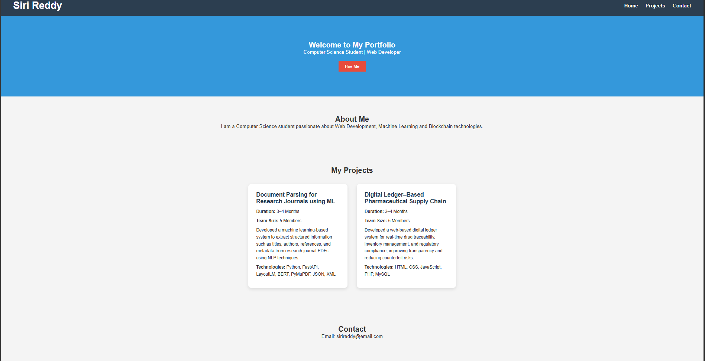
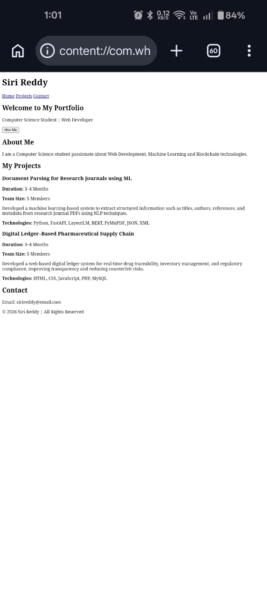

# 🌐 Portfolio Website

## 📌 Project Overview
This is a responsive portfolio website developed using HTML and CSS. 
It showcases my academic projects, technical skills, and web design abilities 
in a clean and professional layout.

---

## 🎯 Objective
To design and implement a modern, responsive portfolio website 
using core web technologies and CSS styling techniques.

---

## 🛠 Technologies Used
- HTML5
- CSS3
- Flexbox
- Media Queries

---

## 📂 Project Structure
portfolio-website/
│
├── index.html
├── style.css
├── README.md
├── images/
└── screenshots/

---

## ✨ Features
- Responsive Design (Mobile Friendly)
- Flexbox Layout
- Hover Effects & Transitions
- Modern Card-Based Project Section
- Clean Color Scheme
- Organized Folder Structure

---

## 🧠 Projects Included

### 1️⃣ Document Parsing for Research Journals using ML
- Duration: 3–4 Months
- Team Size: 5 Members
- Extracted structured data from research journal PDFs using NLP.
- Technologies: Python, FastAPI, LayoutLM, BERT, PyMuPDF, JSON, XML

### 2️⃣ Digital Ledger–Based Pharmaceutical Supply Chain
- Duration: 3–4 Months
- Team Size: 5 Members
- Developed a digital ledger system for drug traceability and compliance.
- Technologies: HTML, CSS, JavaScript, PHP, MySQL

---

## 📱 Responsive Design
The website adapts to different screen sizes using CSS media queries. 
On smaller screens, navigation and project cards stack vertically.

---

## 🚀 How to Run the Project
1. Download or clone the repository
2. Open the project folder
3. Open index.html in any web browser

---
---

## 📸 Screenshots

### 💻 Desktop View

### 📱 Mobile View

## 👩‍💻 Author
Siri Reddy  

Computer Science Student
